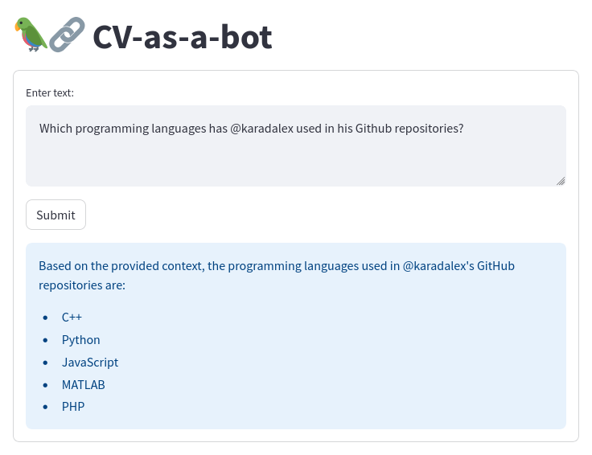
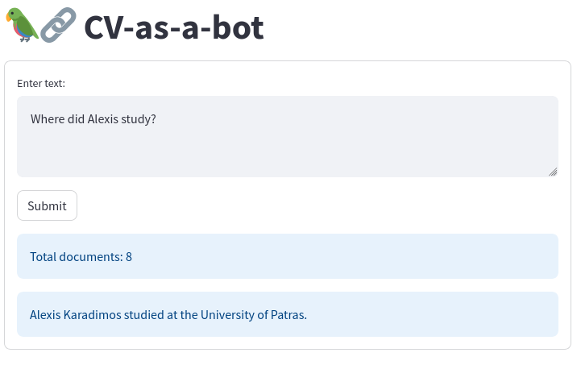
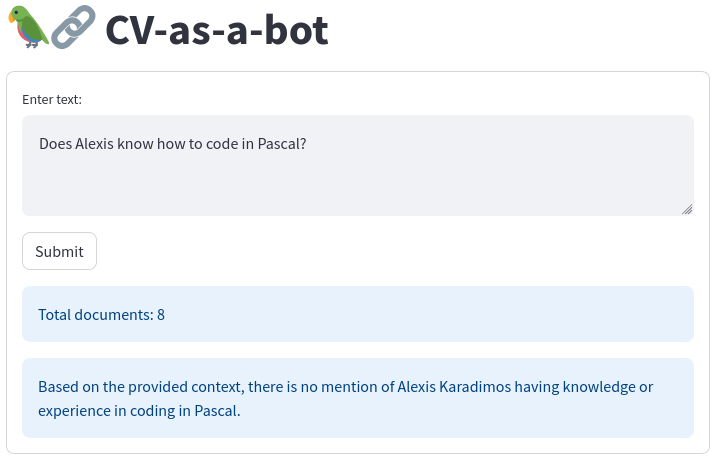
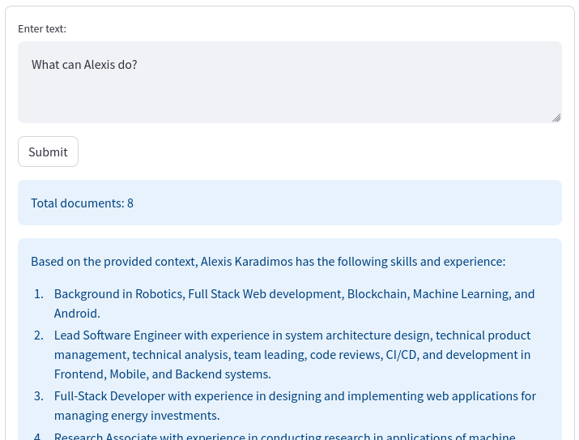

CV-as-a-bot
===========

Examples of valid answers: <br>


<br>
More open-ended question:<br>


Ask this RAG LLM chatbot anything you want to learn about my Curriculum Vitae

```bash
virtualenv . -p /usr/bin/python3.8
source bin/activate
pip install -r requirements.txt
streamlit run main.py
```
